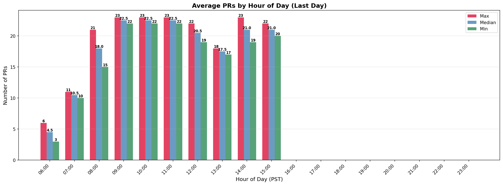
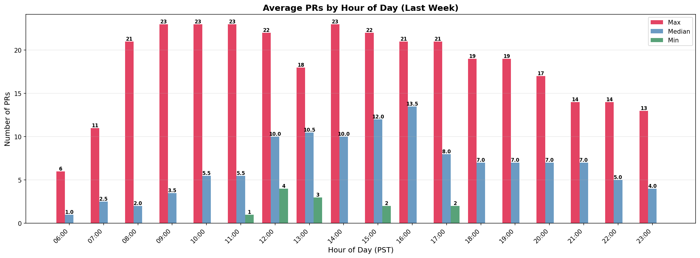
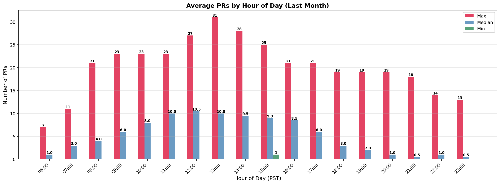
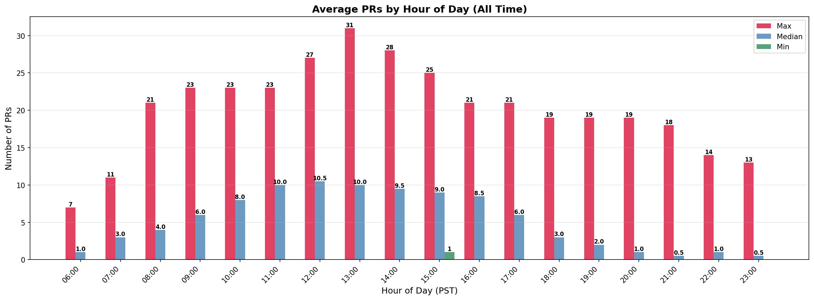

# Merge Queue Statistics

This branch contains automated merge queue statistics collected every 30 minutes.

## Average PRs by Hour of Day (PST)

### Last Day

### Last Week

### Last Month

### All Time

## Files

- `summarized.csv` - CSV summary of all collected statistics
- `prs_by_hour_*.png` - Graphs showing average PRs by hour of day for different time periods
- `stats/YYYY-MM/merge_queue_YYYYMMDD_HHMMSS.json` - Individual JSON stats files organized by month
